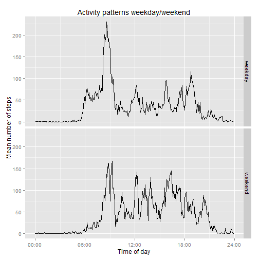

## Loading and preprocessing the data

In this section we read the data and do a bit of processing to simplify plotting.


```r
# Options for number formatting
options(scipen=2, digits=2)
library(data.table)
# Read the data, unz helps us read the zip-file directly
data <- read.csv(unz("activity.zip", "activity.csv"), colClasses=c("numeric", "Date", "integer"))
DT <- data.table(data)
# Create a time field for plotting, since the interval is not suitable for this
DT[, `:=`(ihour=as.numeric((interval%/%100)+(interval%%100)/60.0))]
```

```
##        steps       date interval  ihour
##     1:    NA 2012-10-01        0  0.000
##     2:    NA 2012-10-01        5  0.083
##     3:    NA 2012-10-01       10  0.167
##     4:    NA 2012-10-01       15  0.250
##     5:    NA 2012-10-01       20  0.333
##    ---                                 
## 17564:    NA 2012-11-30     2335 23.583
## 17565:    NA 2012-11-30     2340 23.667
## 17566:    NA 2012-11-30     2345 23.750
## 17567:    NA 2012-11-30     2350 23.833
## 17568:    NA 2012-11-30     2355 23.917
```

## What is mean total number of steps taken per day?

```r
library(ggplot2)
# Create a sum of steps by date
DS <- DT[!is.na(steps),.(stepsum=sum(steps)), by=date]
# Plot a histogram
hist(DS$stepsum, xlab="Number of steps", main="Histogram of total daily steps")
```

 

```r
# Calculate mean and median
meansteps <- mean(DS[,stepsum])
mediansteps <- median(DS[,stepsum])
```

The mean numer of steps per day is 10766.19 and the median 10765 steps.


## What is the average daily activity pattern?

```r
AD <- DT[, .(smean=mean(steps, na.rm=T)), .(interval,ihour)]
with(AD, plot(ihour, smean, type="l", xlab="Time of day (hours)", ylab="Steps", main="Average daily activity pattern"))
```

 

```r
#with(AD, plot(interval, smean, type="l", xlab="Interval"))
# Find the top interval
top_interval <- AD[smean==(AD[, max(smean)]), interval]
thour = top_interval %/% 100
tmin = top_interval %% 100
```

The interval with the highest number of steps on average is the interval 835. That is the interval starting at hour 8, minute 35.


## Imputing missing values

Impute missing values by using the mean for that interval.


```r
# How many missing values are there?
DT[is.na(steps), .("Missing values"=.N)]
```

```
##    Missing values
## 1:           2304
```

```r
# Create a new dataset where we'll impute missing values
DTI <- DT
# Add the mean values for each interval to the table
invisible(DTI[,`:=`(imean=mean(steps, na.rm=T)), by=interval])
# Use the mean values for the interval to impute missing values
invisible(DTI[is.na(steps),`:=`(steps=imean)])
# Create a sum of steps by date
DSI <- DTI[,.(stepsum=sum(steps)), date]
hist(DSI$stepsum, xlab="Number of steps", main="Histogram of total daily steps")
```

 

```r
imeansteps <- mean(DSI[,stepsum])
imediansteps <- median(DSI[,stepsum])
```
The mean number of steps per day is 10766.19 and the median 10766.19 steps. Since we use the mean to impute the missing values, it is unchanged, but the median has changed, the old median was 10765.


## Are there differences in activity patterns between weekdays and weekends?

```r
daytype <- function(dayname) {
    weekdays <- c("Monday", "Tuesday", "Wednesday", "Thursday", "Friday")
    if(dayname %in% weekdays) {
        return(factor("weekday", c("weekday", "weekend")))
    }
    factor("weekend", c("weekday", "weekend"))
}

invisible(DTI[,`:=`(wd=weekdays(strptime(date, format="%Y-%m-%d")))])
invisible(DTI[,we:=sapply(wd, daytype)])
WS <- DTI[, .(smean=mean(steps, na.rm=T)), by=.(interval, ihour, we)]
qplot(data=WS, x=ihour, y=smean, facets=we~., geom="line", xlab="Time of day (hours)",ylab="Mean number of steps")
```

 
